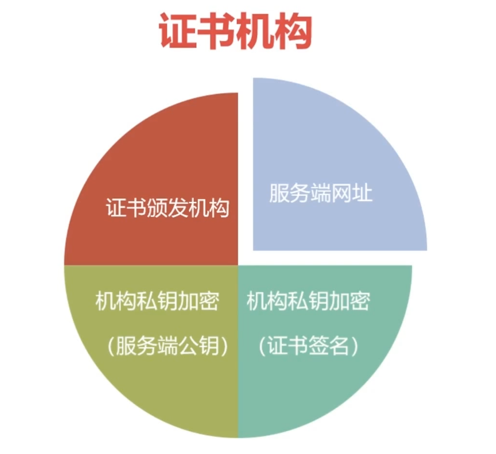
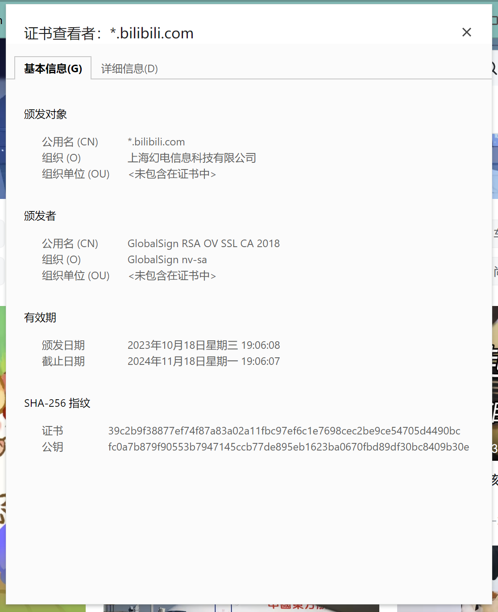

# https

## 非对称加密

加密和解密用的不同的密钥
 - 公钥加密
 - 私钥解密
 - 这个过程是可逆的
    - 私钥加密可以用公钥解密 （这就是数字签名）

公钥加密，私钥解密（只有接收者能看到信息）
私钥签名，公钥验签（确认发送者的身份）

## 证书

为了解决第三人攻击的问题，引入第三方机构来对服务端身份进行认证！

举个例子 bilibili的证书

client ---> server(证书)

## 三大目标

内容加密
- 非对称密钥交换
- 对称加密内容

身份认证
- 数字证书
- 服务端向权威机构申请证书
- 预置的CA证书可信吗？

数据完整性