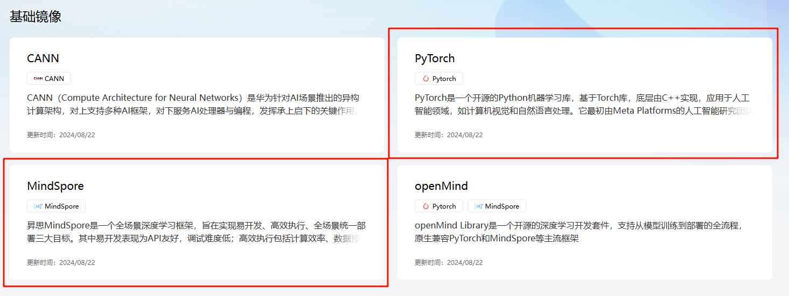

基础镜像提供了开发和运行AI应用必备的基础环境，包含了CANN, AI框架, 以及openmind工具链镜像。

- CANN（Compute Architecture for Neural Networks）是华为针对AI场景推出的异构计算架构，对上支持多种AI框架，对下服务AI处理器与编程，发挥承上启下的关键作用，是提升昇腾AI处理器计算效率的关键平台。同时针对多样化应用场景，提供高效易用的编程接口，支持用户快速构建基于昇腾平台的AI应用和业务

如果不想使用基础的CANN，可以使用基础的AI框架镜像，直接使用AI框架进行开发。

- AI框架镜像包括了MindSpore和PyTorch两个AI框架

镜像中心也提供了openMind工具链镜像，方便用户直接进行模型预训练、微调、推理、部署等任务。

- 点击tags页面可以找到您想要的版本，包括不同的OS，python，openmind版本，一键拉取并运行。

