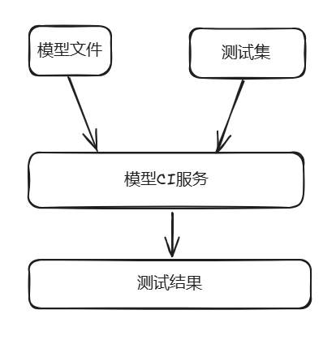

# openMind背后的技术揭秘：镜像创新实践

## 一、openMind

[openMind](https://modelers.cn/)是一款应用使能开发套件，原生支持昇腾NPU处理器，为各大模型社区提供支持，提供海量模型/数据托管能力、在线推理体验服务，还支持接入内容审核、病毒扫描等服务，可以帮助平台伙伴快速构建社区。同时，openMind应用使能工具链还能提供模型训练、微调、评估、推理等全流程开发能力、开发者通过简单的API即可实现微调、推理等任务，极大缩短开发周期。具体来说，它提供下面的工具以及服务：

- [openMind应用使能工具链](https://modelers.cn/docs/zh/openmind-library/overview.html)：openMind Library是一个深度学习开发套件，通过简单易用的API支持模型预训练、微调、推理等流程。openMind Library通过一套接口兼容PyTorch和MindSpore等主流框架，同时原生支持昇腾NPU处理器。
- [模型](https://modelers.cn/models)：托管用于自然语言学习、视觉和音频等任务的模型。
	- [模型CI](https://modelers.cn/docs/zh/community/models/verifying_models.html)：模型可用性测试旨在验证用户基于本文档编写的自定义推理用例在NPU上执行是否通过。
- [数据集](https://modelers.cn/datasets)：托管用于翻译、语音识别和图像分类等任务的数据集，包含生成训练、评估和测试所需的数据。
- [体验空间](https://modelers.cn/spaces)：提供机器学习和深度学习算法的应用案例，在浏览器即可演示模型的交互式应用程序。除了在线的服务，我们还支持用户一键离线部署复现体验空间。
- [镜像中心](https://modelers.cn/images)：镜像仓库，为昇腾以及openMind用户提供常用的镜像，快速构建和部署AI应用，或进行二次开发。

为了降低开发者使用门槛，满足用户开箱即用的体验，支撑openMind高效运行，统一的镜像起到了关键作用。

## 二、镜像分层构建

当用户使用openMind工具链进行本地大模型训练、推理，或者尝试复现体验空间时，需要提前准备好基础环境。这个环境需要正确的安装必要的加速库、运行时、软件、配置文件等。对用户来说，是一个非常耗时的工作。

为了避免用户花费大量精力在配置环境上，我们提供了**基础镜像（基础的应用开发运行环境）**，包括了CANN，MindSpore，PyTorch，openMind，我们从软件栈的视角看，如下图：

自底向上包括操作系统，Python，CANN，AI框架，大模型框架，应用层不包含在基础镜像里面，由用户自行添加和二次构建，包括不限于FastChat、Gradio等。

各层软件对应的变量以及部分取值如下表：

| variable      | value                               |
| ------------- | ----------------------------------- |
| os            | ubuntu,openeuler                    |
| python        | python3.8,python3.9                 |
| cann          | cann8.0.rc1.beta1,cann8.0.rc2.beta1 |
| framework     | mindspore2.3.1,pytorch2.1.0         |
| llm-framework | openmind0.7.1,openmind0.8.0         |

我们按照软件栈自底向上的顺序，对镜像tag命名，规范如下：

CANN（基于OS和Python构建）
- cann:`os`-`python`-`cann`
- 例如，cann:ubuntu-python3.9-cann8.0.rc2.beta1

AI框架（基于CANN构建）
- mindspore:`os`-`python`-`cann`-`framework`
- pytorch:`os`-`python`-`cann`-`framework`
- 例如，pytorch:ubuntu-python3.8-cann8.0.rc1.beta1-pytorch2.2.0，mindspore:openeuler-python3.8-mindspore2.3.0rc1

openMind（基于AI框架构建）
- openmind:`os`-`python`-`cann`-`framework`-`llm-framework`
- 例如，openmind:openeuler-python3.9-cann8.0.rc2.beta1-pytorch2.1.0-openmind0.8.0

CANN和AI框架镜像已发布到 [ascendai's Profile | Docker Hub](https://hub.docker.com/u/ascendai)，[Quay Container Registry · Quay](https://quay.io/organization/ascend)，[镜像中心 | 魔乐社区 (modelers.cn)](https://modelers.cn/images)，openMind镜像发布到了[镜像中心 | 魔乐社区 (modelers.cn)](https://modelers.cn/images)

示例如下：
```bash
# quay.io
docker pull quay.io/ascend/mindspore:ubuntu-python3.8-cann8.0.rc1.beta1-mindspore2.3.0rc1
# dockerhub
docker pull ascendai/cann:openeuler-python3.9-cann8.0.rc2.beta1
# openMind镜像中心
docker pull registry.modelers.cn/base_image/openmind:openeuler-python3.9-cann8.0.rc2.beta1-mindspore2.3.1-openmind0.8.0
```

## 三、镜像中心

[镜像中心](https://modelers.cn/images), 目标是为昇腾以及openMind用户提供常用的镜像，使用基础镜像为底座，根据不同业务需求、用户场景分层堆叠，满足于全场景需求，保证基础归一，底座同源，包括推理引擎、工具镜像、应用镜像、模型镜像。


当前已经提供了基础镜像、内容持续丰富中


## 四、体验空间镜像

体验空间是一个可演示模型的交互式应用程序，从AI软件栈的视角来看，它属于应用层


那么当用户创建体验空间的时候，体验空间服务会根据用户的空间环境选择基础镜像，打包用户的代码和数据构建体验空间镜像，并且基于它创建服务。如下图：


- 当用户选择 PyTorch (openeuler-python3.9-cann8.0.rc2.beta1-pytorch2.1.0-openmind0.8.0) 基础环境，对应的基础镜像就是 registry.modelers.cn/base_image/openmind:openeuler-python3.9-cann8.0.rc2.beta1-pytorch2.1.0-openmind0.8.0

体验空间镜像是对外可获取的，点击`离线体验`，本地执行docker命令，就会创建与在线体验一致的服务，可以自由迁移到任意环境上。


## 五、模型CI

在日常开发中，提交代码一般会触发CI/CD，保证已有特性和新增特性的可用性。对于openMind社区生产的模型，我们借鉴软件CI/CD的能力，提供可用性测试能力保证模型在不同环境的可用性。



为了能快速在不同环境上测试，模型CI服务会根据测试版本选择镜像中心里对应的openMind镜像，创建对应Job，执行测试脚本。

下图展示了 qwen_7b_base 测试结果，可以下载测试日志，分析定位后重新进行测试。
