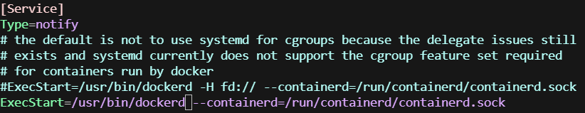

# 配置远程docker

一般情况下，我们都通过docker CLI访问本地的docker服务，有些场景下需要访问远端的docker服务，比如本地是容器环境，容器不方便支持docker命令。为了支持本地docker client访问远程docker服务，实现镜像构建和上传，以及跨平台构建，需要对远程服务器的docker做一些配置。

## 具体步骤

### 1. docker版本要求，20.10以上

### 2. 镜像构建机器VM的ISA无特定要求，linux/arm64或者linux/amd64均可

### 3. 为了支持跨平台镜像构建，需要qemu，它提供了跨平台构建功能
```bash
docker run --privileged --rm tonistiigi/binfmt --install all
```

### 4. 配置docker监听本地的2375端口

修改 `/etc/docker/daemon.json`内容为
```bash
{
  "hosts": [
    "tcp://0.0.0.0:2375",
    "unix:///var/run/docker.sock"
  ],
  "experimental": true
}
```

### 5. 修改docker服务默认启动命令

编辑 `/usr/lib/systemd/system/docker.service`中的ExecStart字段值为 `/usr/bin/dockerd --containerd=/run/containerd/containerd.sock`



### 6. 重启docker服务

```bash
sudo systemctl daemon-reload
sudo systemctl restart docker
```

### 参考

1. https://juejin.cn/post/7075225595050721310#heading-4
2. https://docs.docker.com/reference/cli/dockerd/#daemon-socket-option